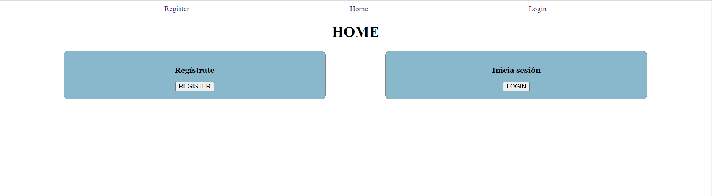
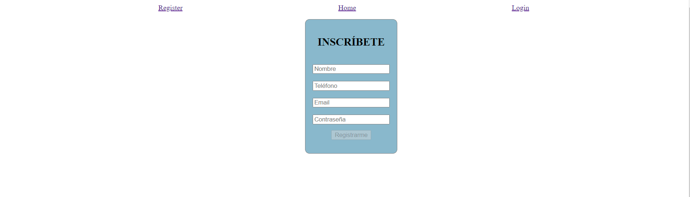
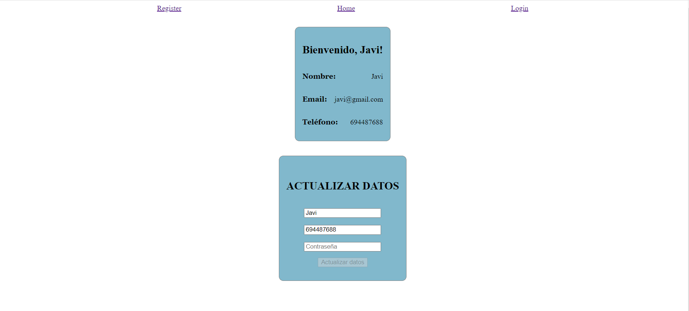
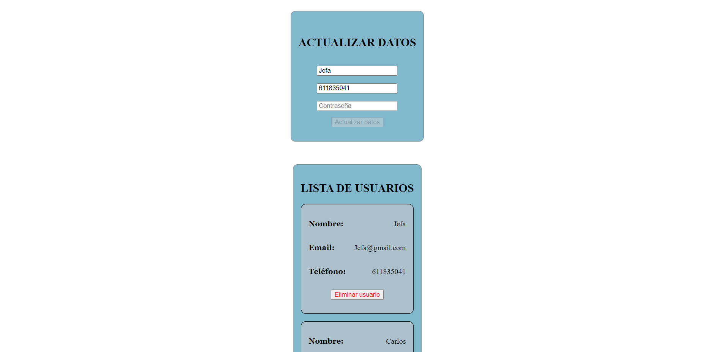

# front_prueba_tecnica

## Información general

Este proyecto consiste en el Front-End de una API de registro, login, modificar, listar y eliminar usuarios, realizada con Vue3.

## Índice

Algunas de las funcionalidades son:

- Registrar usuario
- Inicio de sesión de un usuario
- Modificar datos de usuario
- Mostrar todos los usuarios
- Eliminar un usuario

## Repositorios

[Front End](https://github.com/JavierMoyaSimo/front_prueba_tecnica)

[Back End](https://github.com/JavierMoyaSimo/back_prueba_tecnica)

---

---

## Vistas

Vista principal: 'Home'.
 

 

Vista de registro
 

 

Vista de Login
 

 

Vista de usuario (rol "user")

 

 

Vista de usuario (rol "admin")

 

 

---

## Tecnologías, dependencias y librerías

Front End:

- [HTML5](https://html5.org/)
- [CSS3](https://developer.mozilla.org/en-US/docs/Web/CSS)
- [JavaScript](https://www.javascript.com/)
- [Vue3](https://vuejs.org/)

Back End:

- [JavaScript](https://www.javascript.com/)
- [Node](https://nodejs.org/en/)
- [Express](https://expressjs.com/)
- [Mongoose](https://mongoosejs.com/)
- [Jwt-decode](https://jwt.io/)
- [Axios](https://axios-http.com//)
- [MongoDB](https://www.mongodb.com/)

---

## Autor

Javier Moya Simó

- [Linked In](https://www.linkedin.com/in/javier-moya-simo/)
- [Github](https://github.com/JavierMoyaSimo)

---

## Licencia

---

